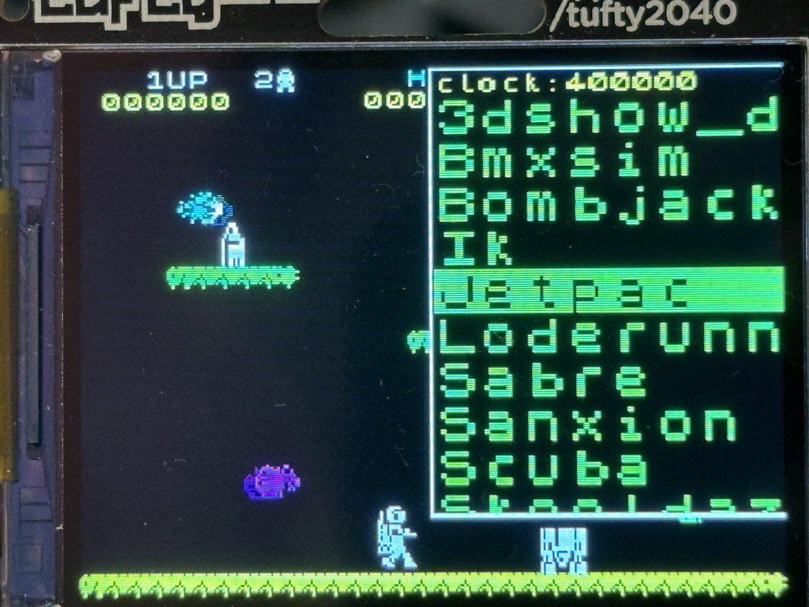

The **ZX2040** is a port of [Andre Weissflog](https://github.com/floooh/chips/) ZX Spectrum emulator to the Raspberry Pico RP2040, packed with a simple UI for game selection and key mapping to make it usable without a keyboard.

This project is specifically designed for the Raspberry Pico and ST77xx based displays. Our reference device is the [Pimoroni Tufty RP2040 display board](https://shop.pimoroni.com/products/tufty-2040?variant=40036912595027), but actually the code can run into any Raspberry Pico equipped with an ST77x display and five buttons connected to five different pins. The buttons work as inputs for the four gaming directions (left, right, top, bottom) and the fire button. Please refer to the *hardware* section for more information.

**Video demo** [here](https://www.youtube.com/watch?v=Xxz8N-SCUJU).



## Main features

* **Pico -> Spectrum key mapping** with each pin mapped up to two Spectrum keys or Kempstone joystick moves. Each game has its own key map, taking advantage of mapping to make games easier to play on portable devices: for instance Jetpac maps a single key (down key) to up + fire. Key macros are used in order to automatically trigger key presses when given frames are reached, to select the kempstone joystick, skip key redefinition, and other things otherwise impossible with few buttons available on the device. No need to recompile to add keymaps.
* A **minimal ST77xx display driver is included**, written specifically for this project. It has just what it is needed to initialize the display and refresh the screen with the Spectrum frame buffer content. It works both with SPI and 8-wires parallel interfaces and is optimized for fast bulk refreshes.
* The emulator has an **UI that allows to select games** into a list, change certain emulation settings and so forth.
* **Easy games upload**, with a script to create a binary image of Z80 games and transfer it into the Pico flash. Games don't need to match the keymap by name: grepping inside memory for known strings is used instead, so you can create your own Z80 snapshots files, and still defined keymaps will work.
* **Real time upscaling and downscaling** of video, to use the emulator with displays that are larger or smaller than the Spectrum video output. The emulator is also able to remove borders.
* **Partial update of the display** by tracking memory accesses to the video memory, so that it is possible to transfer a subset of the scanlines to the physical display. This feature can be turned on and off interactively.
* **Crazy overclocking** to make it work fast enough :D **Warning**: the code must run from the Pico RAM, and not in the memory mapped flash, otherwise it's not possible to go at 400Mhz. This is achieved simply with `pico_set_binary_type(zx copy_to_ram)` in `CMakeList.txt`. There are no problems accessing the flash to load games, because the code down-clocks the CPU when loading games, and then returns at a higher overclocking speeds immediately after.

## Changes made to the original emulator

The fantastic emulator I used as a base for this project was not designed for very small devices. It was rather optimized for the elegance of the implementation (you have self-contained emulated chips that are put together with the set of returned pins states) and very accurate emulation. To make it run on the Pico, I had to modify the emulator in the following ways:

* In order to work with the small amount of RAM available in the RP2040, only the Spectrum 48k version is emulated, the 128k code and allocations were removed. The video decoding was also removed. Now the decoding is performed on the fly in the screen update function of the emulator, by reading directly from the Spectrum video memory (this also provided a strong speedup).
* The emulator UI itself is rendered directly inside the Spectrum video memory in order to save memory.
* Emulation performances were improved by rewriting video decoding and modifying the Z80 implementation to cheat a bit (well, a lot): many steps of instruction fetching were combined together, slow instructions executed in less cycles, memory accesses done directly inside the Z80 emulation tick, and so forth. This makes the resulting emulator no longer cycle accurate, but otherwise we could go at best at 60% of the speed of real hardware, which is not enough for a nice gaming experience.
* Audio support was completely rewritten using the Pico second core and double buffering. We have two issues with the RP2040. One is memory. Fortunately there is no need to go from 1 bit music to 16bit samples that will then drive a speaker exactly with 1 bit of actual resolution. It makes sense in the original emulator, since the audio device of a real computer will accept proper 16 bit audio samples, but in the Pico we just drive a pin with a connected speaker. So this repository implements a bitmap audio buffer, reducing the memory usage by a factor of 32. Another major problem is that we are emulating the Spectrum native speed by running without pauses: there is no way to be sure about the exact timing of a full tick (different sequences of instructions run at different speed), and the audio must be played as it is produced (in the original emulator it was assumed that the CPU of the host computer was able to emulate the Spectrum much faster, take the audio buffer, and put the samples in the audio output queue). So I used double buffering, and as the Z80 produces the music we play the other half of the buffer in the other thread, with adaptive timing. The result is recognizable audio even if the quality is not superb.

With this changes, when the Pico is overclocked at 400Mhz (default of this code, **with cpu voltage set to 1.3V**), the emulation speed matches a real ZX Spectrum 48K. If you want to go slower (simpler to play games, and certain Picos may not run well at 400Mhz) press the right button when powering up: this will select 300Mhz.

Please note that a few of this changes are somewhat breaking the emulation accuracy of the original emulator, but they are a needed compromise with performances on the RP2040 and good frame rate. A 20 FPS emulator that runs very smoothly is a nice thing, but breaking the Z80 precise clock may mess a bit with certain games and demos. Moreover, the way we plot the video memory instantaneously N times per second is different than what the ULA does: a game may try to "follow" the CRT beam (for example removing the old sprites once it is sure the beam is over a given part). Most games are resilient to these inconsistencies with the original hardware, but when it's an issue, we resort to game specific tuning of the emulator timing parameters (see the keymap file inside the `games` directory).

## Motivations for this project

The ZX Spectrum was the computer where I learned to code when I was a child. Before owning the Spectrum, I used to play with my father's computer, a TI 99/4A, yet the Spectrum was my first real computer, and the one where I wrote my first decent programs. So part of this is nostalgia.

On a more practical way, I wanted an emulator that was a good fit for the Pico and specifically conceived to run with cheap displays, able to easily be adapted to different displays resolutions, MIT licensed, very easy to hack on. So that people can build, enjoy and even sell if they want battery-powered small cheap Spectrum. This can help to make the ZX Spectrum heritage last more in the future.

Finally, I needed to explore a bit more the Pico SDK and its C development experience. Recently I'm doing embedded programming, and the RP2040 is one of the most interesting MCUs out there. Writing this code was extremely helpful to better understand the platform.

## Credits

I want to thank [Andre Weissflog](https://github.com/floooh) for writing the original code and let us dream again. If this project was possible it is 90% because of his work.

## Hardware needed

You need either:

* A Pimoroni Tufty 2040.
* Or, any other suitable Pico + display + 5 buttons combination.

and...

* A piezo speaker if you want audio support.

This project only supports ST77xx displays so far. They are cheap and widespread, and they work well and exist in different qualities: TFT, IPS, and so forth.

A note of warning: it is crucial to be able to refresh the display
fast enough. SPI displays work well if they are not huge, let's say that up to
320x240 max the update latency will not be so terrible. However support for partial display update makes the performance of large displays much better in practice, see the next section.

Parallel 8-lines ST77xx displays are much better, for instance in the Tufty 2040, using upscaling, it is possible to transfer the Spectrum CRT frame buffer to the display in something like ~14 milliseconds, so even refreshing the display ~20 times per second we have 700 milliseconds of CPU time to run the emulator itself.

320x240 displays are particularly good because the Spectrum full visible area including borders is 320x256 pixels, so when borders are enabled this is a nice view. When borders are disabled, it's even better: the bitmap resolution of the Spectrum is 256x192 pixels, it means that using 125% upscaling we match exactly the 320x240 display resolution!

The display should also be big enough if you want a nice play experience. Spectrum games were designed to be displayed in a big TV set, so certain details can be too small if very small displays are used. 2.4" is a nice size. Larger is even better.

## Display partial update

If your display is big and/or slow, the display refresh time can slow down
the emulator significantly. If that's the case, when creating the `device_config.h` file for your board, make sure to enable partial update of display using the following define:

    #define DEFAULT_DISPLAY_PARTIAL_UPDATE 1

You can enable this feature even from the menu, but setting the define will make it on by default.

When this feature is enabled, the emulator tracks video memory accesses in a bitmap of *affected scanlines*. Later, when writing the Spectrum video memory on the display, only the scanlines touched by the ZX Spectrum program running will actually be transferred to the display. This is a very significant speedup.

Please note that when the menu is shown, the emulator always uses full updates of the display, so in order to evaluate the performance gain make sure to enter the game with the menu dismissed.

## Installation from sources

If you build from sources:

* Install `picotool` (`pip install picotool`, or alike) and the Pico SDK.
* Create a `device_config.h` file in the main directory. For the Pimoroni Tufty 2040 just do `cp devices/tufty2040.h device_config.h`. Otherwise if you have some different board, or you made one by hand with a Pico and an ST77xx display, just check the self-commented example file under the `devices` directory and create a configuration for your setup: it's easy, just define your pins and the display interface (SPI/parallel).
* Compile with: `mkdir build; cd build; cmake ..; make`.
* Transfer the resulting `zx.uf2` file to your Pico (put it in boot mode pressing the boot button as you power up the device, then drag the file in the `RPI-RP2` drive you see as a USB drive).

## Installation from pre-built images

For the Tufty 2040 there is a ready to flash UF2 file inside the `uf2` directory.

## Adding games

If you run the emulator just after the installation, you will see the Spectrum BASIC screen and a text telling you there are no loaded games in the emulator.

To upload games:

* Enter the `games` directory.
* Copy your games snapshots (.Z80 files) inside the Z80 directory. There is already a demo made in the 90s there.
* Check if there is already a keymap defined for your games in the `keymaps.txt` file inside the `games` directory. Games without a keymap defined will likely not work with the default keymap, often to start the game pressing some key is needed, also to select a joystick and so forth. To add a keymap, see the next section. Otherwise, to start more easily, just use the games for which there is already a keymap defined (see list below).
* Put the Pico in boot mode (power-off, press BOOT button, power-on while the button is pressed), with the Pico connected via USB to your computer.
* Run the ./loadgames.py script to upload the game image.

The `loadgames.py` will contactenate the Z80 files and the keymap file and will store it into the flash. The bundle can be stored everywhere as long as the address is a multiple of 4096 and does not overwrite the emulator program itself.

Now, if you power-up the emulator, you will see the list of games.

## Creating keymaps

A keymap maps your define buttons (pins, actually) to Spectrum buttons and joystick moves. This is a very simple keymap for Jetpac:

```
# Jetpack.
MATCH:JETPAC IS LOADING
l1|l
r2|r
f4|f
d|f|u   Up + fire combo for simpler playing
u5|u
@10:41  Press 4 at frame 10 to select Kempstone
```

Lines starting with `#` are just comments.
Then there is a mandatory first line called `MATCH:`. This line will grep the Spectrum memory content (after loading the game) looking for strings matching the game. This way the Jetpac keymap above, will work with Z80 files obtained in different ways, they don't have to be specially named, or to exactly match a given digest or alike. If you want to create a keymap for a game, just open the Z80 file with some editor and look for some unique string to match.

Sometimes it is needed to match multiple strings to be sure that it's a given game. For example the Bombjack keymap uses this match lines:

```
MATCH:Elite Systems Presents
AND-MATCH:BEST BOMBERS
```

You can have all the `AND-MATCH` statements you want.

Then, there are the actual mapping information. They are of three types:

1. Standard mapping, like `l12`, which means map button left pin (as defined in `device_config.h`) to Spectrum keys '1' and '2' (each button on your device can control up to two keys in the Spectrum). You can just write `rx` if you want to associate the left button on your device to a single Spectrum key, `x` in this case.
2. Extended mapping, like `xur0`, which maps *two* device buttons to a single Spectrum key. This is needed for games where 5 buttons are not enough, so combinations of those buttons are needed.
3. Macro mappings, pressing keys automatically at a given frame during the game execution. For instance `@20:k2` means: at frame 20 press the key `k` for two frames. Then release it.

There are a few special things to know about mappings.

* Device keys are called `l`, `r`, `u`, `d`, `f`: left, right, up, down, fire.
* To map to the space key, ~ is used. So `f~` will map the fire button to the Spectrum space.
* You can map buttons to Kempston joystick movements using the special | character: `l|l` means map the device left button to the joystick left movement.
* Extended devices are just `x<device-button1><device-button2><spectrum-key>`. See the example above.
* Macros use "frames" as timer. To create a new map, to make sure when you want to do certain actions, just power-up the device with the left button pressed: a frames counter will show up in the left-top corner, so you can see when it's the right frame to trigger actions.

Certain games have specific requirements about the CRT refresh. This emulator does not emulate the CRT, but writes the video memory directly on the display in one pass (even if it try to syncrhonize with vertical blank interrupt in order to do so). If you see sprites flickering, you may want to use this special directive `SCANLINE-PERIOD` in the keymap. See the example below.

```
# Thrust. Give it a bit more redrawing time with scanline period of 170.
MATCH:>>>THRUST<<<
SCANLINE-PERIOD:170
la|l
rs|r
fim
dm|d
up|u
@20:n1      Do you want to refine keys? [N]o
```

Other times, like in Skool Daze, the scanline period is reduced in order to trigger the vertical blank interrupt more often and make the game faster.

## Usage

* Select the game and press the fire button to load it. The press the fire button again with the loaded game selected to leave the menu.
* Long press left+right to return back to the menu.
* Start with the left button pressed for more serial debugging and frame counter.
* Start with the right button pressed to boot with a less extreme overclocking (300Mhz instead of 400Mhz). You can adjust it from the menu.

## Games compatibility

This repository includes keymaps that work with the following games:

* [Jetpac](https://en.wikipedia.org/wiki/Jetpac)
* [Loderunner](https://en.wikipedia.org/wiki/Lode_Runner)
* [International Karate+](https://en.wikipedia.org/wiki/International_Karate_%2B)
* [Sabre Wulf](https://en.wikipedia.org/wiki/Sabre_Wulf)
* [Sanxion](https://en.wikipedia.org/wiki/Sanxion)
* [Scuba Dive](https://worldofspectrum.org/archive/software/games/scuba-dive-durell-software-ltd)
* [Thrust](https://en.wikipedia.org/wiki/Thrust_\(video_game\))
* [BMX Simulator](https://en.wikipedia.org/wiki/BMX_Simulator)
* [Bombjack](https://en.wikipedia.org/wiki/Bomb_Jack)
* [Skool Daze](https://en.wikipedia.org/wiki/Skool_Daze)
* [Pac-Man](https://marco-leal-zx.itch.io/zx-pacman-arcade) incredible conversion by Marco Leal

## Demos compatibility

This is the only demo I tested so far:

* [3D Show](https://worldofspectrum.net/item/0007729/) (19xx), Vektor Graphix.

## Using this emulator for commercial purposes

All the code here MIT licensed, so you are free to use this emulator for commercial purposes. Feel free to sell it, put it as example in your boards or whatever you want to do with it. **However please note that games you find in the wild are often copyrighted material** and are not under a free license. Either use free software games with a suitable license (there are new games developed for the Spectrum every year, very cool ones too: pick the ones with a suitable license), or ask permission to the copyright owners. In any case, **you will be responsible for your actions, not me :)**.

About the ZX Spectrum ROM included in this repository, this is copyrighted material, and the current owner is the Sky Group, so if you want to do a commercial product using this code using also the ROM, you need to contact Sky Group. This is what happened so far:
* The original owner was Sinclair, that was sold to Amstrad.
* Amstrad agreed that having the ROMs as parts of NON commercial use was fair use. That's really cool, and one of the reasons why Spectrum emulators are legal.
* Then Amstrad was sold to the Sky Group. Apparently the ZX Spectrum Next has official permission from the Sky Group to use the ROM. So the position of the Sky Group is yet very open.
* However if you want to make anything commercial with the ROM, you need an official written permission. If you want to use this emulator without the ROM, to run a snapshot image that does not use any code inside the ROM, you can just discard the ROM file, and use this emulator for any purpose.
